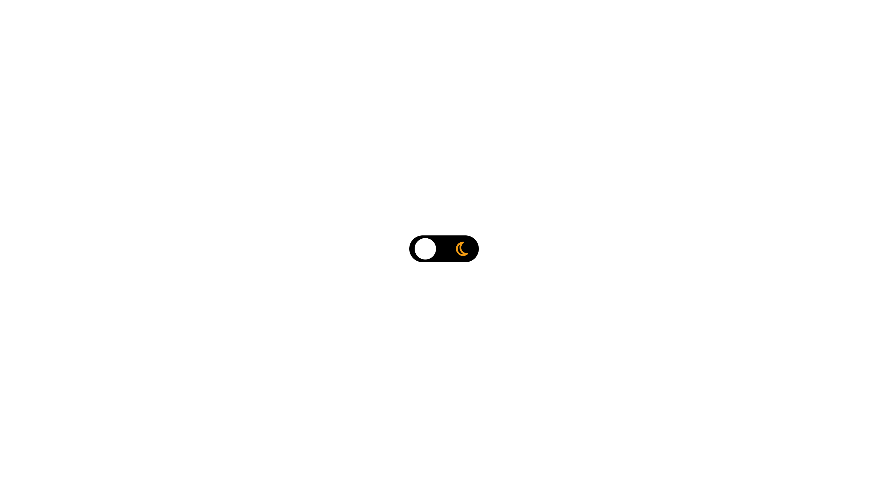
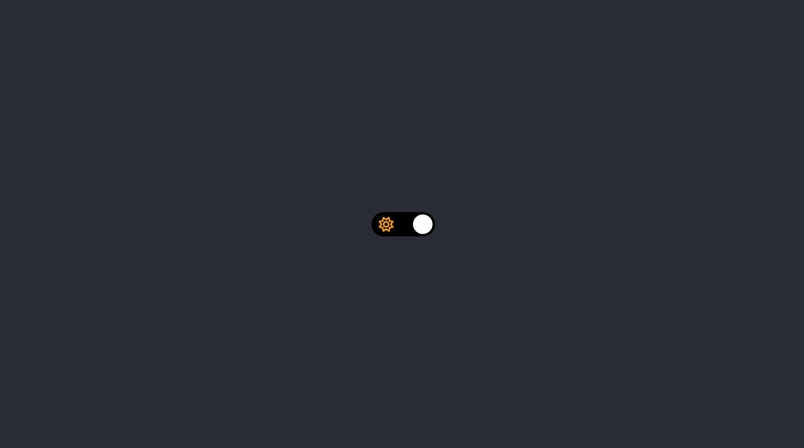

<strong><h1 align="center">#Dark Mode</h1></strong>

  
  

## 🚀 Tecnologias

Esse projeto foi desenvolvido com as seguintes tecnologias:

- HTML
- SCSS
- JAVASCRITP

---

Feito com ♥ by [johnrsfc]